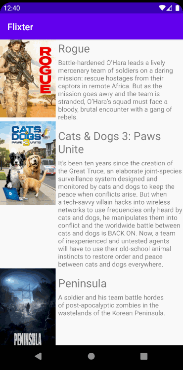

## Flixter

This app uses a movies API to display the current movies in theaters on Android.

### App Walkthough GIF

 

### Notes

Describe any challenges encountered while building the app.

## Open-source libraries used
- [Android Async HTTP](https://github.com/codepath/CPAsyncHttpClient) - Simple asynchronous HTTP requests with JSON parsing
- [Glide](https://github.com/bumptech/glide) - Image loading and caching library for Android
